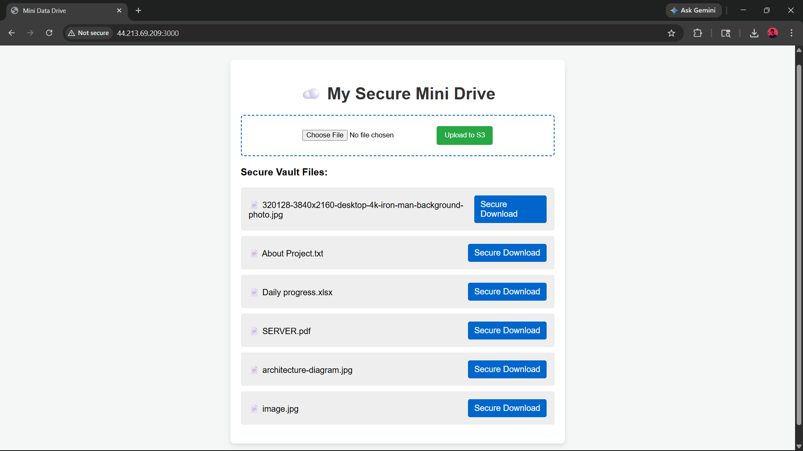
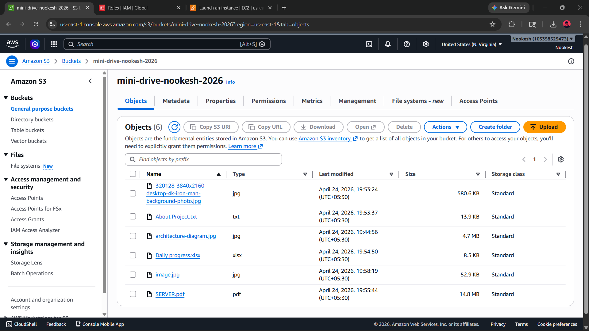
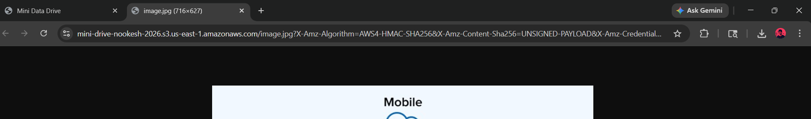
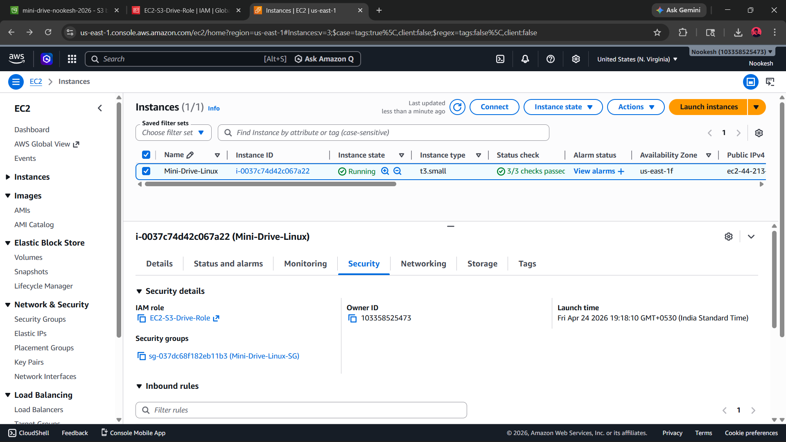

# mini-data-drive-aws
A secure, cloud-native AWS S3 file vault built with Node.js, EC2, IAM Roles, and Pre-Signed URLs
# ☁️ Secure AWS S3 File Vault (Mini Data Drive)

## 📌 Project Overview
I built a custom "Mini Data Drive" web application hosted on AWS. The goal of this project was to learn how to decouple storage from compute, creating a highly secure cloud vault. This setup is perfect for safely storing heavy media assets and video projects directly in the cloud without relying on commercial third-party drives.

Instead of saving files directly onto a web server's hard drive, this Node.js application acts as a secure bridge, routing all user uploads directly into an Amazon S3 bucket.

## 🧱 How It Works 
1. A user accesses the web interface hosted on a lightweight Amazon EC2 Linux server.
2. The user uploads a document or media file via the browser.
3. The Node.js backend securely transmits the file to an Amazon S3 Bucket using the AWS SDK.
4. When a user wants to download their file, the application generates a temporary, self-destructing **Pre-Signed URL**.
5. The user downloads the file securely, straight from S3.

## ⚙️ Key Cloud & Security Features

### 🔹 Identity and Access Management (IAM Roles)
Hardcoding AWS passwords (access keys) into application code is a major security risk. Instead, I assigned an **IAM Role** directly to the EC2 instance. This gives the server invisible, secure permission to interact with S3. The Node.js code inherits this access automatically!

### 🔹 100% Private S3 Storage & Pre-Signed URLs
The S3 bucket is completely locked down. No one can access the files via direct links. To allow downloads, the backend dynamically creates an AWS **Pre-Signed URL**. This is a highly secure link that grants temporary access to a single file and completely expires after 60 seconds.

### 🔹 Cloud-Native Linux Compute
I deployed this application on **Amazon Linux 2023** rather than Windows. Using a lightweight Linux environment for a Node.js server reduces boot times to seconds and drastically lowers compute overhead.

## 📸 Infrastructure Proof

**1. The Application Interface**

**2. Secure Private Bucket Verification**

**3. Temporary Pre-Signed URL in Action**

*(Notice the massive, temporary security token generated in the URL bar for the download).*

**4. Passwordless Security (IAM Role Attached)**

